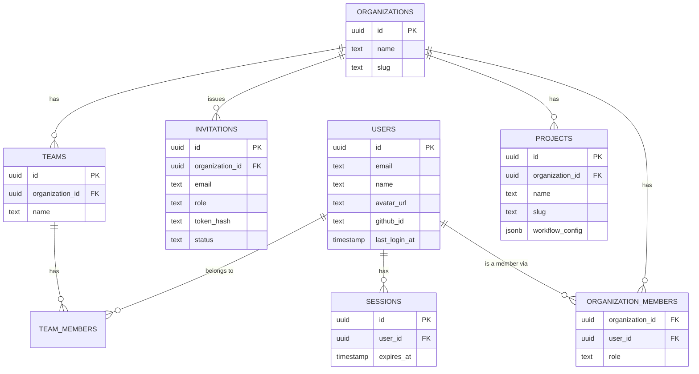

# Wave 1 — Identity & Tenancy: architecture & design

**Status:** Draft — for review before implementation
**Scope source:** [`phase-1.md`](../../../phase-1.md) §4 · [`project.md`](../../../project.md) §9, §11
**Modules covered:** Identity & Access, Organizations, Projects (built together — Projects and org membership both depend on Identity, and all three share the same org-scoping mechanism).

> **Done when** (from `phase-1.md`): a user can sign up, create an org, invite a
> member with a role, create a project with a workflow config, and all
> reads/writes are org-scoped.

This doc is the low-level design for that slice. It follows the layered-docs
model (`project.md` §14): read `project.md` §9/§11 and `phase-1.md` §4 first;
this is the level below. Review this before any code lands.

> **Revision note (post-review):** §3.2 (session-token hashing), §3.4 (DAL
> takes `ctx` + resource id, compound `where`), §4 (invite email match, no
> raw-token logging, ownership invariants + concurrency), §5 (slug
> normalization, `workflow_config.version`), §6 (explicit table scope
> classification), and §7 (authn/authz separation; all project routes nested)
> were tightened after a design review. See §11 for the resolution log.

---

## 1. Scope for this wave

In scope:

- Sign in with GitHub OAuth (user identity only — separate from the GitHub
  **App** installation that Wave 2's SourceControl adapter will use).
- Server-side sessions, HTTP-only cookie.
- Organizations, membership with a role, invitations.
- Projects with a workflow config (branch naming, PR title convention, review
  policy).
- Structural org-scoping so a handler cannot accidentally query across orgs.

Explicitly **out of scope** for this wave (flagged for review, not silently
assumed):

| Item                                    | Deferred to                               | Why                                                                                                                                                                                          |
| --------------------------------------- | ----------------------------------------- | -------------------------------------------------------------------------------------------------------------------------------------------------------------------------------------------- |
| Linking a project to a real GitHub repo | Wave 2                                    | Requires the GitHub App install + `SourceControlProvider` port, which don't exist yet. Wave 1 only stores the workflow config; the repo-link table ships with the adapter that populates it. |
| Sending invitation emails               | Later (no notifications/email module yet) | No transactional-email provider chosen. The invite endpoint returns the invite link directly (also logged); a real delivery mechanism is additive later.                                     |
| Team-level permissions                  | P2+                                       | `teams` in this wave are a grouping/label only (e.g. "Platform Team"). All authorization stays at the org-membership role — teams do not carry their own role or ACL yet.                    |
| Password login, magic links             | Not planned                               | OAuth-only keeps this wave small and avoids owning credential storage/reset flows.                                                                                                           |

---

## 2. Domain model



`organizations` already exists (Wave 0 placeholder, used by the outbox demo)
and needs no schema change — it already has `id`, `name`, `slug`,
timestamps.

---

## 3. Identity & Access

### 3.1 Auth flow — GitHub OAuth (user login)

A separate, narrowly-scoped GitHub **App** (registered dedicated to login —
Account permissions: `Email addresses: Read-only` only, no repository/org
access, no webhook, no installation required) is used for sign-in via its
user-to-server web application flow. This is deliberately **not** the GitHub
App Wave 2 will install org-wide for repo/PR/check access — conflating the
two would mean a user's login session inherits repo-access permissions it
doesn't need, and would tie account login to an org having that app
installed at all. (GitHub Apps fix permissions at registration time rather
than requesting OAuth scopes at runtime — see registration notes below.)

```mermaid
sequenceDiagram
    participant Browser
    participant API as apps/api
    participant GitHub

    Browser->>API: GET /api/v1/auth/github/authorize
    API->>API: generate + cookie a signed state (CSRF)
    API-->>Browser: 302 → github.com/login/oauth/authorize?state=...
    Browser->>GitHub: user approves
    GitHub-->>Browser: 302 → /api/v1/auth/github/callback?code&state
    Browser->>API: GET .../callback?code&state
    API->>API: verify state matches cookie
    API->>GitHub: exchange code → access token
    GitHub-->>API: token
    API->>GitHub: GET /user, GET /user/emails
    GitHub-->>API: profile
    API->>API: findOrCreate user by github_id
    API->>API: create session row, set HttpOnly cookie (random token; DB stores its hash)
    API-->>Browser: 302 → web app (post-login redirect)
```

Notes:

- The GitHub user access token is used only to fetch the profile at login;
  it is **not stored** (no need — Wave 2's GitHub App tokens are what
  perform source-control operations).
- The OAuth service resolves the user's **verified primary email** from
  `GET /user/emails` (`primary && verified`), never an arbitrary entry — this
  is the identity used for `findOrCreate` and for invitation matching (§4).
  A user with no verified email is rejected at login.
- `state` is a cryptographically random value in a short-TTL (~10 min),
  signed, `HttpOnly` cookie; it is compared for equality **before** the code
  exchange and consumed (cleared) on callback — standard OAuth CSRF
  protection (§8).
- First-time login creates a `users` row with no org membership. The user
  then either creates an org (becomes `owner`) or accepts an invitation.

### 3.2 Sessions

- Opaque server-side session, **not JWT** — matches `phase-1.md`'s
  "sessions (HTTP-only)" and allows immediate server-side revocation
  (logout, "sign out everywhere") without a token blocklist.
- **The cookie holds a random 256-bit session token; the database stores only
  its SHA-256 hash** (`sessions.token_hash`), never the raw token — same
  rationale as invitation tokens (§8): a DB leak doesn't hand an attacker
  live session credentials. On each request the plugin hashes the cookie
  value and looks up the row by `token_hash`. The `sessions.id` (a UUID) is
  the internal PK used by FKs/logs; it is **not** what's in the cookie.
- Cookie attributes: `HttpOnly`, `Secure` (prod), `SameSite=Lax`, signed with
  `@fastify/cookie`.
- `sessions` table: `id`, `user_id`, `token_hash` (unique), `created_at`,
  `expires_at`, `ip`, `user_agent`. Default TTL 30 days (configurable).
  **Sliding refresh threshold is explicit:** on a successful request, if less
  than **7 days** remain before `expires_at`, extend it back to a full 30 days
  from now; otherwise leave it untouched. This bounds write amplification (a
  session is refreshed at most once per ~23-day active window, not on every
  request) while keeping active sessions alive — revisit only if profiling
  shows the write is hot.
- Logout deletes the session row and clears the cookie.

### 3.3 RBAC

Roles come from the existing canonical enum (`packages/types/src/enums.ts`,
already defined): `owner > admin > developer/reviewer (peer) > viewer`.
Roles are **org-scoped** (a `organization_members.role`), not global on the
user — a user can belong to multiple orgs with a different role in each.

| Action                                      | owner | admin | developer | reviewer | viewer |
| ------------------------------------------- | ----- | ----- | --------- | -------- | ------ |
| View org, projects, members                 | ✅    | ✅    | ✅        | ✅       | ✅     |
| Create/edit project + workflow config       | ✅    | ✅    | ❌        | ❌       | ❌     |
| Invite member / change role / remove member | ✅    | ✅    | ❌        | ❌       | ❌     |
| Change org settings (name, slug)            | ✅    | ✅    | ❌        | ❌       | ❌     |
| Delete org                                  | ✅    | ❌    | ❌        | ❌       | ❌     |
| Transfer ownership                          | ✅    | ❌    | ❌        | ❌       | ❌     |

(`developer` vs `reviewer` distinction matters starting Wave 3/4 — PR review
assignment and AI-review-required gates — so both exist now for schema
stability, but carry identical permissions in this wave.)

### 3.4 Structural org-scoping (the actual mechanism)

`phase-1.md` requires org-scoping to be enforced **structurally**, not
per-handler. Concretely:

1. Every org-scoped route is nested under the org id:
   `/api/v1/organizations/:organizationId/...`.
2. A new `authPlugin` (`plugins/auth.ts`) resolves the session cookie into
   `request.user` (`{ id, email, name }`) on every request; it does **not**
   know about a "current org" — there isn't one server-side.
3. A `requireOrgRole(...roles)` preHandler reads `:organizationId` from the
   route params, loads the caller's membership for that org, 403s if absent
   or role insufficient, and decorates `request.orgContext = { organizationId, userId, role }`.
4. **Org-scoped services and dal functions take `OrgContext` as their first
   argument, never a raw `organizationId` string, and never accept a
   client-supplied org id.** `OrgContext` is opaque — its only constructor is
   `requireOrgRole`, which builds it from a verified session + a real
   membership row:

   ```ts
   type OrgContext = {
     readonly organizationId: OrganizationId;
     readonly userId: UserId;
     readonly role: Role;
   };
   ```

5. **A resource id is always paired with `ctx`, and the query filters on
   both** — this closes the cross-tenant lookup where a caller authorized for
   Org A supplies a resource id belonging to Org B:

   ```ts
   // ❌ never — org id as a bare, forgettable/spoofable parameter
   getProject(db, projectId, organizationId);

   // ✅ always — ctx first, resource id second, compound where
   export function getProject(db: Database, ctx: OrgContext, projectId: ProjectId) {
     return db.query.projects.findFirst({
       where: and(
         eq(schema.projects.id, projectId),
         eq(schema.projects.organizationId, ctx.organizationId),
       ),
     });
   }
   ```

   A row from another org simply isn't returned (404, not a leak). This
   applies to **indirectly** scoped tables too: an org-scoped operation on
   `team_members` takes `ctx` and joins/verifies that the team belongs to
   `ctx.organizationId` — the dal never accepts a bare `teamId` for an
   org-scoped write. See the table-scope classification in §6.

This is the same "can't be built without an org id" idea called out in
`phase-1.md` §4 — `OrgContext` is the thing that can't be built without one.
Global (non-org) tables — `users`, `sessions`, `organizations` — are the
explicit exception and are scoped by `user_id`/`id` instead (§6).

---

## 4. Organizations

- **Create org** — any authenticated user; creator becomes `owner`. Done in
  one transaction: insert `organizations` row + `organization_members` row
  (`role='owner'`) + publish `organization.created` via the outbox.
- **Invitations** — `admin`/`owner` only. Flow:
  1. `POST /organizations/:id/invitations { email, role }` → generates a
     random 256-bit token, stores **only its SHA-256 hash** (`token_hash`) +
     `status='pending'` + `expires_at` (7 days), and returns the raw
     token/link in the **response body only** (see §1 — no email sending
     yet). The raw token / invite URL is **never written to logs** — doing so
     would recreate the very secret store the hashing avoids. The
     `member.invited` event and any log line carry only
     `{ invitation_id, organization_id, invited_by_user_id, email, role, expires_at }`.
  2. `POST /invitations/:token/accept` (authenticated) → hashes the
     provided token, looks up a pending non-expired invitation, then
     **verifies the accepting user's verified primary email matches the
     invitation email** before creating the `organization_members` row and
     marking the invitation `accepted`. Mismatch → 403. This prevents a
     leaked/intercepted token from being redeemed onto a different account.
     (Tradeoff: a user whose GitHub primary email differs from the invited
     address must be re-invited at their primary — acceptable for MVP; a
     "claim by any verified email" relaxation is a deliberate later choice,
     not a default.)
  - Re-inviting an already-pending email **replaces** the prior invitation in
    a single transaction (mark the existing `pending` row `revoked`, insert
    the new one), so there is only ever one active invitation per
    `(org, email)`. This is enforced by a **partial unique index** on
    `(organization_id, email) WHERE status = 'pending'`. Drizzle expresses
    this via `uniqueIndex(...).on(...).where(sql\`status = 'pending'\`)`(same
partial-index pattern already used for`outbox_events`in`packages/database`), so it round-trips through `drizzle-kit` migrations
    cleanly; the transactional replace avoids a unique-violation race between
    revoke and insert.
- **Teams** — `admin`/`owner` create/rename; a plain grouping of members
  within an org (`team_members`), no independent ACL this wave (see §1).
- **Ownership & membership invariants** — enforced **inside a transaction
  with row locking on the org's `organization_members`** (not just a
  handler-level read-then-write, which races: two concurrent removals could
  each observe two owners and both proceed). Invariants:
  - an org always has ≥ 1 `owner`;
  - the last `owner` cannot be removed, cannot demote themselves, and cannot
    leave the org;
  - ownership transfer is a single transaction (promote target → then
    demote/keep source) that never transiently drops below one owner;
  - deleting an org is `owner`-only.

Events published (outbox): `organization.created`, `member.invited`,
`member.joined`, `member.role_changed`, `member.removed`.

---

## 5. Projects

- `projects`: `organization_id`, `name`, `slug` (unique per org), `key`
  (short uppercase code, e.g. `ENG` — reserved now for future ticket
  numbering, not used yet), `workflow_config` (jsonb), timestamps.
- **Slug service contract is explicit:** if the client **supplies** a `slug`
  it must already be in canonical form — the `slugSchema` validates it and a
  non-canonical value (uppercase, spaces, etc.) is a `400`, never silently
  rewritten. If the client **omits** the slug, the service **derives** it
  from `name` by normalizing (`"Acme Engineering" → "acme-engineering"`). So
  normalization only ever happens on name-derived slugs; client-supplied
  slugs are validated, not mutated. Same rule for org slugs.
- `workflow_config` shape (validated with a Zod schema, stored as jsonb —
  avoids a schema migration every time a workflow knob is added, matches
  the "config" nature of this data). It carries an explicit `version` so a
  future shape change (`version: 2`) never silently reinterprets old rows:

  ```ts
  {
    version: 1; // config schema version, not project version
    branchNamingPattern: string; // e.g. "{type}/{ticketKey}-{slug}"
    prTitleTemplate: string; // e.g. "[{ticketKey}] {title}"
    reviewPolicy: {
      requiredApprovals: number; // default 1
      requireAiReview: boolean; // default true — Wave 4 gate, stored now
    }
  }
  ```

- Create/edit requires `admin`/`owner` (see RBAC table). Any org member can
  read.
- No `project_repositories` table yet — see §1. When Wave 2 lands, it adds
  that table plus the connect flow; this wave's `projects` schema doesn't
  need to change for that (additive, per the provider-framework rule in
  `project.md` §8).

Events published: `project.created`, `project.workflow_config_updated`.

---

## 6. New database tables

All in `packages/database/src/schema/`, one file per table (existing
convention), re-exported from `schema/index.ts`.

### 6.1 Tenancy scope classification

Not every table is org-scoped, and indirect ownership is **not** treated as
"structurally safe" — each table declares how it is isolated, and the dal
layer honors exactly that (§3.4):

| Table                  | Scope          | Isolation key                                                  |
| ---------------------- | -------------- | -------------------------------------------------------------- |
| `users`                | Global         | `id` / `github_id`                                             |
| `sessions`             | Global         | `user_id` (looked up by `token_hash`)                          |
| `organizations`        | Global         | `id` (list filtered by caller's memberships)                   |
| `organization_members` | Org            | `organization_id`                                              |
| `invitations`          | Org            | `organization_id`                                              |
| `teams`                | Org            | `organization_id`                                              |
| `team_members`         | Org (via team) | team must belong to `ctx.organizationId` — verified in the dal |
| `projects`             | Org            | `organization_id`                                              |

Global tables are only ever reached through the authenticated `request.user`
(never a client-supplied id); org tables go through `OrgContext`;
`team_members` is the one indirect case and its org-scoped operations verify
the team's owning org rather than trusting a bare `teamId`.

### 6.2 Table definitions

| File                      | Table                  | Key columns                                                                                                                            |
| ------------------------- | ---------------------- | -------------------------------------------------------------------------------------------------------------------------------------- |
| `users.ts`                | `users`                | `id`, `email` (unique), `name`, `avatar_url`, `github_id` (unique, nullable-safe since only one auth provider exists), `last_login_at` |
| `sessions.ts`             | `sessions`             | `id`, `user_id` FK, `token_hash` (unique), `expires_at`, `ip`, `user_agent`                                                            |
| `organization-members.ts` | `organization_members` | `organization_id` FK, `user_id` FK, `role`, unique(`organization_id`,`user_id`)                                                        |
| `invitations.ts`          | `invitations`          | `id`, `organization_id` FK, `email`, `role`, `token_hash`, `status`, `invited_by_user_id` FK, `expires_at`                             |
| `teams.ts`                | `teams`                | `id`, `organization_id` FK, `name`, `slug`                                                                                             |
| `team-members.ts`         | `team_members`         | `team_id` FK, `user_id` FK, unique(`team_id`,`user_id`)                                                                                |
| `projects.ts`             | `projects`             | `id`, `organization_id` FK, `name`, `slug`, `key`, `workflow_config` jsonb, unique(`organization_id`,`slug`)                           |

`packages/types/src/ids.ts` gains branded ids: `SessionId`, `TeamId`,
`InvitationId` (alongside the existing `OrganizationId`, `UserId`,
`ProjectId`, `WorkItemId`).

`packages/validation` gains a `workflowConfigSchema` (mirrors §5) and reuses
the existing `roleSchema`, `emailSchema`, `slugSchema`.

---

## 7. Module & route layout

Following the existing `apps/api` convention (route → service → dal,
routes versioned and outside modules). **Authentication** (who you are) and
**authorization / tenant context** (what org you're acting in and with what
role) are kept as separate concerns — even though `access` isn't a heavy
standalone module yet, the split keeps the boundary clean as Wave 3/4
permissions grow:

```text
src/
├── plugins/
│   └── auth.ts                 # authN only: session cookie → request.user
├── modules/
│   ├── identity/               # authN: who the user is
│   │   ├── dal/  users.dal.ts, sessions.dal.ts
│   │   └── service/  github-oauth.service.ts, session.service.ts
│   ├── access/                 # authZ + tenant context
│   │   └── org-context.ts        # OrgContext type + requireOrgRole() preHandler
│   ├── organizations/
│   │   ├── dal/  organizations.dal.ts, members.dal.ts, invitations.dal.ts, teams.dal.ts
│   │   └── service/  organizations.service.ts, invitations.service.ts, teams.service.ts
│   └── projects/
│       ├── dal/  projects.dal.ts
│       └── service/  projects.service.ts
└── routes/v1/
    ├── auth/            router.ts, schema.ts     # /auth/github/authorize, /auth/github/callback, /auth/session, /auth/logout
    ├── organizations/   router.ts, schema.ts     # see route table below
    ├── invitations/     router.ts, schema.ts     # /invitations/:token/accept
    └── projects/        router.ts, schema.ts     # mounted under the org prefix
```

**All org-scoped resources are nested under the org id at the HTTP boundary**
so `organizationId` is always present for `requireOrgRole` — there is no
top-level `/projects/:id` that would have to resolve the org indirectly:

```text
GET    /organizations/:organizationId/projects
POST   /organizations/:organizationId/projects
GET    /organizations/:organizationId/projects/:projectId
PATCH  /organizations/:organizationId/projects/:projectId
DELETE /organizations/:organizationId/projects/:projectId
```

`OrgContext` + `requireOrgRole` live in the `access` module — the authZ
primitive every org-scoped router depends on; the `auth.ts` plugin stays
purely authN (session → `request.user`).

---

## 8. Security notes

- **Invitation tokens:** random 256-bit, only the SHA-256 hash is persisted;
  the raw token/link is returned in the response body **and never logged**
  (§4) — logging it would recreate the secret the hash avoids.
- **Session tokens:** random 256-bit, cookie carries the raw token, DB stores
  only its SHA-256 hash (§3.2) — a DB leak yields no usable sessions.
- **Invite acceptance** verifies the accepting account's verified primary
  email matches the invitation email (§4) — a leaked token can't be redeemed
  onto another account.
- **OAuth `state`:** cryptographically random, stored in a short-TTL
  (~10 min) signed `HttpOnly` / `Secure` (prod) / `SameSite=Lax` cookie,
  compared for equality before the code exchange, and consumed (cleared)
  on callback. No DB record needed — the signed cookie _is_ the state store.
- **Session cookie:** `HttpOnly`, `Secure` (prod), `SameSite=Lax`, signed. No
  secret ever placed in a URL except the one-time OAuth `code` (GitHub-issued,
  single-use, short-lived).
- **Rate limits:** auth routes (`/auth/github/*`, `/invitations/:token/accept`)
  get a tighter limit than the global default (brute-force / enumeration
  protection).
- **RBAC** is checked in a `preHandler`, before any service/dal code runs — a
  route can't execute business logic before the authz gate.
- **Ownership/membership** mutations run in a transaction with row locking so
  concurrent requests can't both drop the org below one owner (§4).
- **Tenant isolation** is per the scope classification in §6.1 — global tables
  (`users`, `sessions`, `organizations`) are reached only via the
  authenticated `request.user`; org tables via `OrgContext`; no table relies
  on an unverified client-supplied id.

---

## 9. Build sequence (suggested PR slicing)

1. `packages/database`: new tables + migration; `packages/types` new ids;
   `packages/validation` new schemas.
2. `identity` module: users/sessions dal (session **token hashing**), GitHub
   OAuth service (verified-primary-email resolution + `state` handling),
   `auth` plugin (`request.user`), `/auth/*` routes. Testable end-to-end
   against a real GitHub OAuth app in dev.
3. `access` module (`OrgContext` + `requireOrgRole`) + `organizations`
   module: create org (transactional), members, invitations + accept flow
   (email match), teams, ownership invariants (transactional + row-locked).
4. `projects` module: CRUD + workflow config (versioned, slug-normalized),
   nested under the org prefix, gated by `requireOrgRole`.
5. Update `phase-1.md` Wave 1 row + `apps/api/README.md` module list once
   merged.

---

## 10. Open questions for review

1. **GitHub OAuth App vs generic OIDC** — proposing GitHub OAuth only for
   MVP login (every user already has GitHub for source control). Confirm
   this is acceptable vs. wanting a provider-agnostic login from day one.
2. **Invitation delivery** — confirm returning the raw link in the API
   response (for manual sharing / a future email step) is fine for this
   wave, vs. blocking Wave 1 on picking an email provider.
3. **`key` field on `projects`** — reserved for future ticket numbering
   (`ENG-123`); confirm reserving it now vs. adding it when Work Items
   (Wave 3) actually needs it.
4. **Session TTL/refresh values** (30 days, sliding refresh) — placeholder
   defaults, confirm or adjust.

---

## 11. Design-review resolution log

Changes made after the first review pass, with the reasoning:

| #   | Point                              | Resolution                                                                                                                                                 |
| --- | ---------------------------------- | ---------------------------------------------------------------------------------------------------------------------------------------------------------- |
| 1   | Not every table is org-scoped      | Added explicit scope classification (§6.1); global vs org vs indirect.                                                                                     |
| 2   | `OrgContext` misuse                | DAL takes `ctx` + resource id with a compound `where` (§3.4); no bare-`organizationId` org-scoped functions.                                               |
| 3   | Project route scoping              | All project routes nested under `/organizations/:organizationId/...`; dropped top-level `/projects/:id` (§7).                                              |
| 4   | Invite email/account match         | Acceptance requires the accepting account's **verified primary** email to match the invite (§4); UX tradeoff recorded.                                     |
| 5   | Raw invite token in logs           | Never logged; response body only (§4, §8).                                                                                                                 |
| 6   | OAuth `state`                      | Explicit properties adopted (§8). **Adjusted:** kept as a signed short-TTL cookie — a DB-backed state record is unnecessary infra for a 10-min CSRF value. |
| 7   | Session-token hashing              | Adopted — cookie holds random token, DB stores SHA-256 hash (§3.2).                                                                                        |
| 8   | Ownership invariants + concurrency | Transactional + row-locked mutations; full invariant list (§4).                                                                                            |
| 9   | Case-insensitive slugs             | **Adjusted:** `slugSchema` already rejects uppercase; added name→slug normalization rather than `citext`/`lower()` indexes (§5).                           |
| 10  | Workflow-config versioning         | Added `version: 1` field (§5).                                                                                                                             |
| —   | authN/authZ separation             | Split `access` (OrgContext/requireOrgRole) from `identity`; `auth.ts` plugin stays authN-only (§7).                                                        |

### Second-pass clarifications (approved for implementation)

| Point                     | Resolution                                                                                                                                  |
| ------------------------- | ------------------------------------------------------------------------------------------------------------------------------------------- |
| Invite primary-email      | Kept for MVP; explicitly covered by tests (§12) — match, mismatch→403, and no-verified-email cases.                                         |
| Session refresh threshold | Made concrete (§3.2): refresh only when < 7 days remain on a 30-day session, extending back to 30 days.                                     |
| Ownership concurrency     | Explicit concurrent-mutation test required (§12) proving the tx/row-lock preserves ≥1-owner.                                                |
| Slug contract             | Made explicit (§5): client-supplied slugs are validated (400 if non-canonical), never mutated; only name-derived slugs normalized.          |
| Invitation uniqueness     | Partial unique index via Drizzle `uniqueIndex(...).where(...)` (matches `outbox_events`); pending-invite replacement is transactional (§4). |

---

## 12. Testing focus (Wave 1)

Beyond standard per-module unit/integration coverage, these behaviors are
explicitly required (they encode the review's security/correctness concerns):

- **Tenant isolation (§3.4):** a caller authorized for Org A requesting a
  resource id owned by Org B gets a 404, not the row — one test per
  org-scoped resource (projects, members, invitations, teams).
- **Invitation email matching (§4):** accept succeeds when the accepting
  account's verified primary email equals the invite email; **403 on
  mismatch**; login/accept rejected when the account has no verified email.
- **Invitation replacement (§4):** re-inviting a pending `(org, email)`
  leaves exactly one `pending` row and the old token no longer accepts;
  concurrent re-invites don't violate the partial unique index.
- **Ownership concurrency (§4):** two concurrent "remove owner" / "demote
  owner" operations against a 2-owner org must not both succeed — the
  transaction + row lock leaves ≥ 1 owner. Same for a concurrent
  remove-vs-transfer. This test must exercise real concurrent transactions
  (not a serialized mock), since the whole point is the race.
- **Session lifecycle (§3.2):** cookie carries the raw token, DB stores only
  the hash; a request refreshes `expires_at` only inside the final 7-day
  window; logout invalidates the session immediately.
- **RBAC (§3.3):** each protected action is allowed/denied per the role
  matrix (parametric test over roles × actions).
