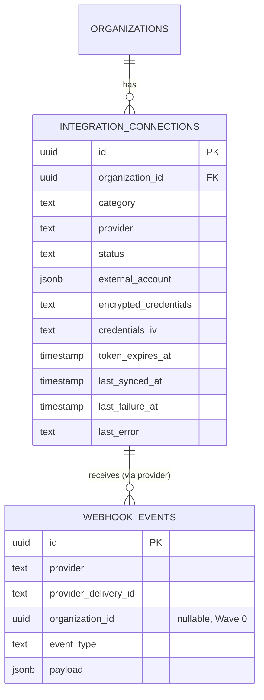
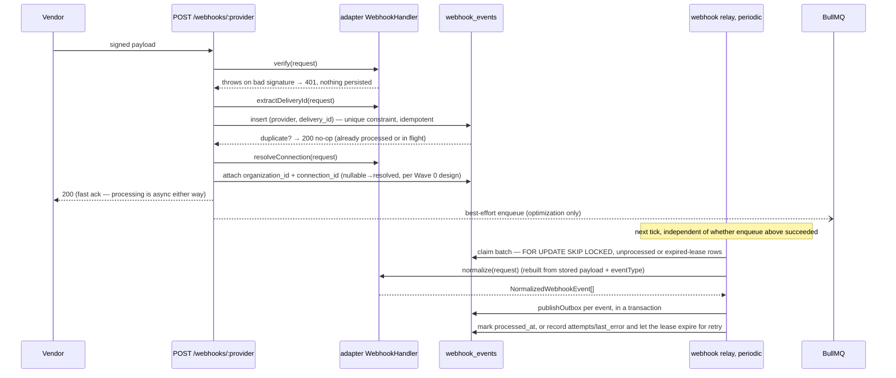

# Wave 2 — Integration Layer: architecture & design

**Status:** Draft — for review before implementation
**Scope source:** [`phase-1.md`](../../../phase-1.md) §5 · [`project.md`](../../../project.md) §8, §9, §10, §11
**Modules covered:** Provider framework core, webhook ingestion, and all four adapters (GitHub, Plane, Slack, Calendar) — built together per the agreed scope, framework first as the pattern the adapters must prove out.

> **Done when** (from `phase-1.md`): each provider can be connected via
> OAuth/app-install, a signed webhook from each is verified, de-duplicated,
> and normalized into a canonical domain event; adapter contract tests pass.

This doc is the low-level design for that slice. Read `project.md` §8 first
(the provider-framework rules); this is the level below.

> **Revision note (post-review):** §3.1 (`resolveConnection` replaces
> `resolveOrganization` + explicit resolution invariant), §3.6 (health
> ownership moved to the service layer), §3.7 (new — outbound idempotency
> tiers), §4 (webhook relay for reliable processing; payload
> retention/redaction), §5 (PR review normalized event), §8 (explicit
> per-method Calendar mapping; scope justification), §9 (webhook_events
> claim-lease columns), and §12 (self-contained signed OAuth state) were
> tightened after a design review. See §16 for the resolution log.

---

## 1. Scope for this wave

In scope:

- `packages/integrations/core` — category ports, normalized domain models,
  capability descriptors, the runtime registry, credential encryption,
  connection-health tracking, and the shared webhook verify→normalize
  contract every adapter implements.
- `packages/integrations/{github,plane,slack,calendar}` — one adapter per
  category, each behind its port, each owning its vendor SDK/HTTP calls,
  auth flow, and webhook verification.
- Generic webhook ingestion route + per-adapter dedupe using the existing
  `webhook_events` table (built in Wave 0, unused until now).
- Connection management API: connect (OAuth/install/token), disconnect,
  status, per-org.
- Normalized domain events published to the outbox for each canonical
  inbound change (PR opened, issue updated, message posted, event created,
  …) — **published, not yet consumed**. Reconciling them into Work Items is
  Wave 3; this wave proves the pipeline end-to-end up to "event exists and
  is visible," matching the done-when criterion above.

Explicitly **out of scope** (flagged, not silently assumed):

| Item                                                                                                                     | Deferred to                                                                                                                                                                                                              | Why                                                                                                                                                                 |
| ------------------------------------------------------------------------------------------------------------------------ | ------------------------------------------------------------------------------------------------------------------------------------------------------------------------------------------------------------------------ | ------------------------------------------------------------------------------------------------------------------------------------------------------------------- |
| Reconciling webhook events into Work Items                                                                               | Wave 3                                                                                                                                                                                                                   | Work Items don't exist yet; this wave's job handlers publish canonical events and stop there.                                                                       |
| Outbound write operations beyond what's needed to prove the port (create branch/PR, post message, create calendar event) | Wave 3 (Development Workflow) for GitHub write paths; this wave still implements the **port methods** (adapters must be complete against their contract) but nothing in Wave 2 itself calls them yet — contract tests do | Matches "framework + adapters," not "orchestration," which is Wave 3's job                                                                                          |
| Connection UI                                                                                                            | Wave 5 (Frontend)                                                                                                                                                                                                        | This wave is API-only; endpoints are designed so the UI is additive                                                                                                 |
| Per-org queue fairness/rate limiting                                                                                     | Later (`project.md` §12, recorded deferral)                                                                                                                                                                              | Explicit known deferral in the architecture doc, not a Wave 2 decision                                                                                              |
| Google Calendar push-notification renewal scheduling                                                                     | Noted, minimal viable version only                                                                                                                                                                                       | Google's channel-watch webhooks expire (max 30 days) and need renewal; a renewal job is simple but is called out as a follow-up, not blocking this wave's done-when |

---

## 2. Domain model



`webhook_events` already exists (Wave 0) with the `(provider,
provider_delivery_id)` unique constraint — this wave is its first real
consumer. One new table: `integration_connections`.

---

## 3. Provider framework core (`packages/integrations/core`)

### 3.1 Category ports

One port per category, defined as a plain TypeScript interface — **no
vendor SDK types anywhere in a port's signature**, only normalized models
(§3.2):

```ts
interface SourceControlPort {
  listRepositories(ctx: ProviderContext): Promise<Repository[]>;
  createBranch(ctx: ProviderContext, input: CreateBranchInput): Promise<Branch>;
  createPullRequest(ctx: ProviderContext, input: CreatePullRequestInput): Promise<PullRequest>;
  getPullRequest(
    ctx: ProviderContext,
    input: { repo: string; number: number },
  ): Promise<PullRequest>;
  createComment(ctx: ProviderContext, input: CreateCommentInput): Promise<Comment>;
  getDiff(ctx: ProviderContext, input: { repo: string; number: number }): Promise<string>;
  upsertCheckRun(ctx: ProviderContext, input: UpsertCheckRunInput): Promise<CheckRun>;
}

interface ProjectManagementPort {
  createIssue(ctx: ProviderContext, input: CreateIssueInput): Promise<Issue>;
  updateIssue(ctx: ProviderContext, input: UpdateIssueInput): Promise<Issue>;
  getIssue(ctx: ProviderContext, input: { externalId: string }): Promise<Issue>;
  createComment(ctx: ProviderContext, input: CreateCommentInput): Promise<Comment>;
}

interface ChatPort {
  listChannels(ctx: ProviderContext): Promise<ChatChannel[]>;
  postMessage(ctx: ProviderContext, input: PostMessageInput): Promise<ChatMessage>;
}

interface CalendarPort {
  listEvents(ctx: ProviderContext, input: { from: Date; to: Date }): Promise<CalendarEvent[]>;
  getFreeBusy(ctx: ProviderContext, input: { from: Date; to: Date }): Promise<FreeBusySlot[]>;
  createEvent(ctx: ProviderContext, input: CreateCalendarEventInput): Promise<CalendarEvent>;
}
```

`ProviderContext` is `{ organizationId: OrganizationId; connectionId: string }`
— every port method is org-scoped structurally, same principle as
`OrgContext` in Wave 1: a port method literally cannot be called without
knowing which org's connection to use.

Each port additionally declares its **webhook contract**, implemented per
adapter, never by application code:

```ts
interface WebhookHandler {
  /** Verifies the signature/secret; throws on failure. Never trusts payload before this. */
  verify(request: RawWebhookRequest): Promise<void>;
  /** Provider-native idempotency key — GitHub X-GitHub-Delivery, Plane event_id, etc. */
  extractDeliveryId(request: RawWebhookRequest): string;
  /** Resolves the specific connection (not just the org) from the payload — installation id, team id, calendar channel id, etc. */
  resolveConnection(
    request: RawWebhookRequest,
  ): Promise<{ organizationId: OrganizationId; connectionId: string } | null>;
  /** Verified + connection-resolved payload → zero or more canonical domain events. */
  normalize(request: RawWebhookRequest): Promise<NormalizedWebhookEvent[]>;
}
```

**Security invariant:** a webhook must resolve to exactly one connection
before any provider data is processed. `resolveConnection` returns the
connection, not just the organization, because credentials and adapter
construction are per-connection — once a second connection per (org,
category) is possible (post-MVP), "organization" alone is no longer a
unique resolution target.

### 3.2 Normalized domain models

Crossing a port, only these cross — never a vendor SDK type (`Octokit`
types, `@slack/web-api` types, etc. stay inside their adapter):

`Repository`, `Branch`, `PullRequest`, `Comment`, `CheckRun`, `Issue`,
`ChatChannel`, `ChatMessage`, `CalendarEvent`, `FreeBusySlot` — each a small,
provider-agnostic interface (e.g. `PullRequest = { externalId, repo, number,
title, state, url, headRef, baseRef, authorExternalId, createdAt,
updatedAt }`). Full field lists are written out when each adapter is
implemented, not enumerated here (this doc stays at the contract-shape
level, matching `project.md` §14's "stay high-level" rule); each adapter's
own doc owns the exact mapping table (vendor field → normalized field).

### 3.3 Capability descriptors

Adapters declare what they support so the registry/UI can react without
`instanceof` checks or hardcoded provider names:

```ts
interface ProviderCapabilities {
  category: IntegrationCategory;
  provider: string;
  supports: Record<string, boolean>; // e.g. { checkRuns: true, diffs: true }
}
```

MVP adapters implement their full port (no partial/optional methods this
wave) — capability flags matter starting P3 when a second adapter per
category (e.g. Jira) might not support everything GitHub-category adapters
do. Declared now so the shape exists; not load-bearing yet.

### 3.4 Runtime registry (resolver, not service locator)

```ts
interface ProviderRegistry {
  resolve<C extends IntegrationCategory>(
    category: C,
    organizationId: OrganizationId,
  ): Promise<PortFor<C>>;
}
```

- Resolution is explicit: **organization + category → active connection row
  → decrypted credentials → constructed adapter instance.** The adapter never
  discovers its own credentials; the registry hands it a ready-to-use config.
- **Used only at the composition edge** — a service (e.g. the future
  Development Workflow module) depends on `SourceControlPort` directly,
  resolved once per request/job, never threading the registry through
  business logic (`project.md` §8).
- One connection per `(organization, category)` in MVP — a second connection
  in the same category isn't supported yet (matches "one adapter per
  category," phase-1 §1).
- **Explicit resolution outcomes** (no outcome is left implicit):

  | Condition                                                              | Result                                                                                                                                               |
  | ---------------------------------------------------------------------- | ---------------------------------------------------------------------------------------------------------------------------------------------------- |
  | No connection row for `(org, category)`                                | `ConnectionNotFoundError` — caller maps to a 4xx ("connect X first")                                                                                 |
  | `status = 'revoked'`                                                   | `ConnectionRevokedError` — same 4xx family, distinct message                                                                                         |
  | `status = 'error'`                                                     | `ConnectionErrorStateError` — surfaced so the caller can point at settings/health, not a generic failure                                             |
  | Credentials fail to decrypt (tampered/corrupted ciphertext, wrong key) | `CredentialDecryptionError`; the registry also flips the connection to `status = 'error'` with `last_error` set, since this is itself a health event |
  | Unknown/unregistered provider for a category                           | Throws hard (500) — a deployment/config bug, never a user-facing condition                                                                           |

### 3.5 Credential encryption

Per-org credentials (GitHub App installation id + optional user token,
Plane API key, Slack bot token, Google refresh token) are **encrypted at
rest**, not stored plaintext, since they're irreversible-impact secrets if
the DB leaks (unlike session/invite tokens, these must be decryptable to
function, so hashing doesn't apply — encryption does):

- AES-256-GCM, application-level, inside `packages/integrations/core`:
  `encryptCredentials(key, plaintext) → { ciphertext, iv, authTag }` /
  `decryptCredentials(key, { ciphertext, iv, authTag })`.
- **Options-in, no env reads** (same rule as `@devflow/queue`/`@devflow/ai`):
  the composition root (`apps/api`) reads `INTEGRATION_CREDENTIALS_KEY`
  (32-byte, base64) from env and passes it into the registry at boot; this
  package never touches `process.env`.
- Key rotation is out of scope for MVP (single static key); recorded as a
  known deferral, not silently ignored.

### 3.6 Connection health

`integration_connections` carries `status` (`connected` | `error` |
`revoked`), `last_synced_at`, `last_failure_at`, `last_error`,
`token_expires_at`. **Ownership sits with the `modules/integrations`
service in `apps/api`, not the adapter package** — an adapter method
returns its result or throws; the service that called it (or the webhook
relay, for inbound failures) is what writes `integration_connections`.
Adapters stay pure port implementations with zero persistence
responsibility, matching the route→service→(dal|ports) layering rule
(`project.md` §7) — an adapter mutating the database directly would blur
that boundary. Matches `project.md` §8's "integration health" requirement;
surfaced by settings UI in Wave 5, not built here.

### 3.7 Outbound idempotency (three tiers)

A pattern every adapter needs, named once here so Wave 3 doesn't
rediscover it per-provider:

1. **Provider-native idempotency** — some APIs accept an idempotency key
   directly (rare among these four; none of GitHub/Plane/Slack/Calendar's
   relevant write endpoints do for MVP's operations).
2. **Adapter-level reconciliation** — where the provider has no native key,
   the adapter checks whether the target resource already exists (by a
   natural key: branch name, issue external id, …) before creating, and
   reconciles instead of duplicating on retry. This is where GitHub's
   branch/PR creation sits (§5).
3. **Application-level job idempotency** — the _caller_ of a port method
   (a BullMQ job) is itself idempotent per `project.md` §10 (stable job
   id, safe-to-retry handler) — independent of whatever the adapter does
   internally. A job retry and an adapter-level reconciliation are two
   different safety nets for two different failure modes (job redelivery
   vs. an actually-duplicate outbound call) and neither substitutes for
   the other.

---

## 4. Webhook ingestion pipeline

One generic route per provider (`POST /api/v1/webhooks/:provider`), thin and
identical in shape across providers — all provider-specific logic lives in
the adapter's `WebhookHandler`. **The route's job-enqueue is a fast-path
optimization, not the only path to processing** — a periodic relay
guarantees eventual processing even if the enqueue is lost, using the
**same claim-lease pattern already proven for `outbox_events`**
(`packages/events`' relay). This closes the gap where a DB insert succeeds
but the enqueue fails and the event would otherwise be silently stranded
(the vendor already got its 200, so it won't redeliver):



Notes:

- **Verify before persist for the signature check itself**, but the
  delivery-id dedupe insert happens right after — matches Wave 0's
  `webhook_events` design (organization_id nullable, attached once
  resolvable) and `project.md` §11 ("webhooks resolve installation →
  organization before any data access").
- The relay is the **authoritative** processing path; the route's enqueue
  is a latency optimization for the common case. Either path ends the same
  way: `normalize()` → `publishOutbox` per event → `processed_at` set.
  This mirrors `packages/events`' outbox relay exactly, reusing a pattern
  already proven in this codebase rather than inventing a new one.
- A signature failure never touches `webhook_events` — nothing unverified
  is persisted, even for debugging (differs from the "unresolved
  connection" case, which _is_ persisted with `organization_id = null` for
  triage).
- Idempotency key per provider (`project.md` §10): GitHub
  `X-GitHub-Delivery` header, Plane `event_id` (not `delivery_id` — call
  this out explicitly since it's easy to use the wrong field), Slack
  `event_id` from the Events API envelope, Google Calendar
  `X-Goog-Channel-ID` + `X-Goog-Message-Number` pair (Calendar's push
  notifications carry no single delivery id — the pair is the natural key).

### 4.1 Payload persistence, retention, and redaction

- **What's persisted:** the full raw JSON body (`payload`) plus a
  provider-derived `event_type` extracted from headers at ingestion time
  (e.g. GitHub's `X-GitHub-Event`) — this is _why_ `event_type` is its own
  column rather than something re-derived from the body later: the relay's
  `normalize()` call needs it and shouldn't have to re-parse headers that
  are gone by then.
- **Headers are not persisted** beyond what's captured into `event_type`.
  Signature verification happens against the live request at ingestion,
  never replayed from a stored header later, so no header needs to survive
  past the request.
- **Payloads can contain user/content data** (Slack message text, Calendar
  event details, PR/issue descriptions) — `webhook_events` is treated as a
  sensitive table (no new access-control mechanism needed beyond normal DB
  access control, but called out so it isn't overlooked).
- **Retention policy is an explicit open question (§15, not a silent
  decision)** — a periodic purge job for old, already-processed rows is the
  likely shape, but the retention window isn't chosen in this doc.

---

## 5. GitHub adapter (`SourceControlPort`)

- **Auth: GitHub App**, org-wide installation — **separate App from Wave
  1's login-only App** (already an explicit decision in
  `wave-1-identity-tenancy.md` §3.1). Permissions: Contents (branches),
  Pull requests (read/write), Checks (read/write), Issues comments
  (read/write) — Metadata read is implicit. Webhook: **Active**, subscribed
  to `pull_request`, `pull_request_review`, `check_run`, `issue_comment`.
- **Connect flow:** `GET /organizations/:id/integrations/github/install`
  redirects to the GitHub App's install URL; callback receives
  `installation_id` + `setup_action`, verified via the App's JWT, then
  stores the connection.
- **Outbound auth:** GitHub App installation access tokens (short-lived,
  ~1 hour), minted on demand from the App's private key + installation id
  — never a long-lived PAT. `token_expires_at` tracked per §3.6, refreshed
  transparently inside the adapter (not visible to the port caller).
- **Webhook verify:** HMAC-SHA256 over the raw body using the webhook
  secret (`X-Hub-Signature-256`), constant-time compare.
- **Idempotency (outbound):** branch/PR creation isn't natively idempotent
  on GitHub's side — tier 2 of §3.7 applies: the adapter checks whether the
  branch/PR already exists (by name/head ref) before creating, reconciling
  instead of duplicating.
- **Normalized events published:** `sourcecontrol.pull_request.opened`,
  `.updated`, `.merged`, `.closed`; `sourcecontrol.pull_request_review.submitted`
  (subscribing to `pull_request_review` without normalizing it would leave an
  unused subscription); `sourcecontrol.check_run.updated`;
  `sourcecontrol.comment.created`.

---

## 6. Plane adapter (`ProjectManagementPort`)

- **Auth: API token + workspace/project identifiers** — Plane's connect
  model is token-based, not a full OAuth redirect (confirm against current
  Plane docs before implementation; recorded as an open question, §15).
  Connect flow is a form (workspace slug + API token), not a redirect.
- **Webhook verify:** HMAC signature over the raw body using a per-webhook
  secret configured in Plane, compared constant-time (mirrors GitHub's
  mechanism; exact header name confirmed during implementation).
- **Idempotency (inbound):** dedupe key is Plane's `event_id` field — **not
  `delivery_id`**, an explicit correction already called out in
  `phase-1.md` §5 because it's an easy mistake.
- **Normalized events published:** `projectmanagement.issue.created`,
  `.updated`, `.comment_created`.

---

## 7. Slack adapter (`ChatPort`)

- **Auth: Slack OAuth v2** (`https://slack.com/oauth/v2/authorize`), bot
  token scopes: `chat:write`, `channels:read`, `groups:read`. Connect flow
  is a standard redirect → callback → token exchange, same shape as
  Wave 1's GitHub login OAuth (state cookie, code exchange) but scoped to
  workspace install, not user login.
- **Webhook verify:** Slack's signing-secret scheme — HMAC-SHA256 over
  `v0:{timestamp}:{raw body}`, compared constant-time, **plus a timestamp
  freshness check (reject if the request is older than 5 minutes)** to
  block replay of an old, valid-looking signed payload.
- **Idempotency:** Slack's Events API includes an `event_id` and may retry
  on slow acks (`X-Slack-Retry-Num`/`X-Slack-Retry-Reason` headers) — dedupe
  on `event_id` exactly like the other providers; the retry headers are
  logged but don't change the dedupe key.
- **Normalized events published:** `chat.message.posted` (inbound messages
  are not currently consumed by any Wave 2/3 logic — captured for
  completeness/future use, not acted on yet).

---

## 8. Calendar adapter (`CalendarPort`)

- **Auth: Google OAuth 2.0**, `calendar.readonly` + `calendar.events` scopes.
  **Port completeness requires `createEvent` (§3.1's `CalendarPort` isn't
  optional-methods this wave), so the OAuth scope is intentionally broader
  than current Wave 2 _consumption_** — MVP only reads/surfaces events
  (`project.md` §15: "MVP scope is connect + surface work-item due dates as
  events"), but the adapter must still be able to write to satisfy the
  port contract and its contract tests. Standard redirect/callback flow,
  offline access (refresh token) requested since the connection must work
  without the user present.
- **Webhook mechanism differs structurally from the other three, but still
  fits `WebhookHandler` without distortion** — each method is implemented
  meaningfully, just not against a signed per-event payload:

  | `WebhookHandler` method | Calendar's implementation                                                                                                                                                                                                         |
  | ----------------------- | --------------------------------------------------------------------------------------------------------------------------------------------------------------------------------------------------------------------------------- |
  | `verify`                | Validates the push-notification headers (`X-Goog-Channel-ID`, `X-Goog-Channel-Token`) against the stored channel registration — there is no per-payload signature to check, but the channel token itself is the verifiable secret |
  | `extractDeliveryId`     | `X-Goog-Channel-ID` + `X-Goog-Message-Number` pair — Calendar has no single delivery id, so the pair is the natural composite key                                                                                                 |
  | `resolveConnection`     | Looks up the connection by `X-Goog-Channel-ID` (channels are registered per connection at watch-setup time)                                                                                                                       |
  | `normalize`             | Ignores the ping's (empty) body entirely and calls back into the Calendar API using the connection's stored sync token, returning the diffed events as `NormalizedWebhookEvent[]`                                                 |

  A dedicated second webhook interface was considered and rejected: every
  method above has a real, non-forced implementation, so introducing a
  parallel abstraction for one adapter would cost framework uniformity
  without buying clarity.

- **Channel expiry:** Google channels expire (max ~30 days); a renewal
  check is a noted follow-up (§1), not blocking.
- **Normalized events published:** `calendar.event.created`, `.updated`,
  `.cancelled`.

---

## 9. New database tables

| File                         | Table                     | Key columns                                                                                                                                                                                                                                     |
| ---------------------------- | ------------------------- | ----------------------------------------------------------------------------------------------------------------------------------------------------------------------------------------------------------------------------------------------- |
| `integration-connections.ts` | `integration_connections` | `id`, `organization_id` FK, `category`, `provider`, `status`, `external_account` jsonb, `encrypted_credentials`, `credentials_iv`, `token_expires_at`, `last_synced_at`, `last_failure_at`, `last_error`, unique(`organization_id`, `category`) |

**Migration to `webhook_events` (Wave 0 table):** add `claimed_by` (text)
and `claim_expires_at` (timestamp) — `processing_started_at` doubles as
`claimed_at`. These mirror `outbox_events`' proven claim-lease columns
exactly, so the webhook relay (§4) can use the identical `FOR UPDATE SKIP
LOCKED` claim query already implemented for outbox processing. Additive,
nullable columns — no backfill needed.

---

## 10. API surface

```text
GET    /organizations/:organizationId/integrations                      # list connections + health
GET    /organizations/:organizationId/integrations/github/install       # 302 → GitHub App install URL
GET    /organizations/:organizationId/integrations/github/callback      # install callback
GET    /organizations/:organizationId/integrations/slack/authorize      # 302 → Slack OAuth
GET    /organizations/:organizationId/integrations/slack/callback
GET    /organizations/:organizationId/integrations/calendar/authorize   # 302 → Google OAuth
GET    /organizations/:organizationId/integrations/calendar/callback
POST   /organizations/:organizationId/integrations/plane/connect        # { workspaceSlug, apiToken }
DELETE /organizations/:organizationId/integrations/:category            # disconnect

POST   /webhooks/github     # unauthenticated (signature-verified), not under /organizations
POST   /webhooks/plane
POST   /webhooks/slack
POST   /webhooks/calendar
```

All `/organizations/:organizationId/integrations/*` connect/disconnect/list
routes are gated by `requireOrgRole('admin')` (connecting a tool is an org
setting, same tier as inviting members/editing projects in Wave 1's RBAC
table) except the OAuth _callback_ endpoints, which can't carry the
session-authenticated org context mid-redirect the same way — the org id
is threaded through the OAuth `state` parameter (signed, short-TTL, same
pattern as Wave 1's GitHub-login state cookie) and re-verified against the
authenticated user's membership on callback. Webhook routes are
**intentionally unauthenticated** (no session possible — the vendor is the
caller) and rely entirely on signature verification.

---

## 11. Module & package layout

```text
packages/integrations/
├── core/
│   ├── src/
│   │   ├── ports.ts              # SourceControlPort, ProjectManagementPort, ChatPort, CalendarPort
│   │   ├── models.ts              # normalized domain models
│   │   ├── webhook.ts             # WebhookHandler contract, RawWebhookRequest, NormalizedWebhookEvent
│   │   ├── relay.ts               # relayWebhooksOnce(db, handlers) — claim-lease processing, mirrors packages/events' outbox relay
│   │   ├── registry.ts            # ProviderRegistry — resolve(category, orgId) → port; explicit error types (§3.4)
│   │   ├── crypto.ts              # encryptCredentials/decryptCredentials (options-in)
│   │   └── index.ts
│   └── package.json
├── github/        # implements SourceControlPort + WebhookHandler
├── plane/         # implements ProjectManagementPort + WebhookHandler
├── slack/         # implements ChatPort + WebhookHandler
└── calendar/      # implements CalendarPort + WebhookHandler (sync-token based normalize)

apps/api/src/
├── modules/integrations/
│   ├── dal/connections.dal.ts     # integration_connections CRUD
│   ├── service/connections.service.ts   # connect/disconnect/list, health writes (§3.6), org-scoped (OrgContext)
│   └── events.ts                  # per-category canonical events (re-exported from adapters or defined per category)
├── plugins/
│   ├── webhook-relay.ts           # schedules relayWebhooksOnce on an interval — mirrors plugins/outbox-relay.ts
│   └── webhook-signature.ts?      # (if a shared preHandler helps; TBD during implementation)
└── routes/v1/
    ├── integrations/{router,schema}.ts   # connect/disconnect/list
    └── webhooks/{router,schema}.ts       # POST /webhooks/:provider
```

Vendor SDKs (`@octokit/*`, `@slack/web-api`, `googleapis`, Plane's REST
client) are dependencies **only of their adapter package** — lint-enforced
per `project.md` §8 (a workspace lint rule restricting these imports to
`packages/integrations/<adapter>` is part of this wave's build sequence).

---

## 12. Security notes

- Webhook signature verification happens **before** any DB write except the
  delivery-id dedupe row itself; a failed verification is a `401` with
  nothing else persisted.
- Slack's timestamp-freshness check specifically defends against replay of
  an old captured (but validly-signed) payload — signature-only checks
  don't catch this, per Slack's own security guidance.
- Credentials encrypted at rest (§3.5); the encryption key is a platform
  secret (`INTEGRATION_CREDENTIALS_KEY`), never per-org, never logged.
- Webhook routes are unauthenticated by necessity — rate-limited more
  tightly than the app default (mirrors Wave 1's `/auth/github/*` treatment)
  since they're an internet-facing, credential-free surface.
- OAuth `state` (Slack, Calendar) is **self-contained and signed**, not
  merely an opaque value matched against a cookie: it carries a random
  nonce, the target `organizationId`, the `provider`, and an expiry,
  signed with the same mechanism as Wave 1's cookie signing. The callback
  validates the signature and expiry from the state value itself —
  authoritative even if the cookie doesn't survive the round trip (some
  browsers/extensions drop cookies across certain redirect chains). The
  short-TTL signed cookie from Wave 1's pattern is **kept as an additional,
  not sole, layer** — it gives single-use enforcement (cleared on
  consumption) that a purely stateless signed value can't provide on its
  own. Either way, **the authenticated caller's org membership is
  re-verified server-side on callback** — the state proves the request's
  provenance, not authorization by itself.
- **Connection resolution is a security boundary, not just a lookup**
  (§3.1): a webhook is processed only after resolving to exactly one
  connection; an unresolvable webhook is persisted for triage (§4.1) but
  never processed as if it belonged to a guessed organization.
- GitHub App installation tokens are short-lived and minted on demand —
  never a long-lived PAT stored per org.

---

## 13. Build sequence (suggested PR slicing)

1. `packages/integrations/core`: ports, models, `WebhookHandler` contract,
   registry with explicit error types (§3.4), `crypto.ts`.
2. `integration_connections` table + `webhook_events` claim-lease migration
   (§9) + `modules/integrations` dal/service in `apps/api` (health ownership
   per §3.6) + connections list/disconnect routes (no working connect flow
   yet — provable once an adapter exists).
3. Generic webhook ingestion route **+ the webhook relay** (dedupe →
   best-effort enqueue → relay as the authoritative path → normalize →
   outbox), tested against a fake in-repo adapter before any real vendor
   exists, to prove the pipeline (including relay recovery) independent of
   any one provider.
4. **GitHub adapter** — connect flow (App install), full `SourceControlPort`,
   webhook verify/normalize, contract tests. Reference implementation the
   other three are validated against.
5. **Plane adapter** — token connect, `ProjectManagementPort`, webhook.
6. **Slack adapter** — OAuth connect, `ChatPort`, webhook (+ timestamp
   check).
7. **Calendar adapter** — OAuth connect, `CalendarPort`, channel-watch
   webhook + sync-token normalize.
8. Lint rule: vendor SDK imports restricted to their adapter package.

---

## 14. Testing focus (Wave 2)

- **Adapter contract tests**: one shared test suite per port
  (`sourceControlPortContractTests(adapterFactory)` etc.) that every
  adapter implementation runs against — catches an adapter silently
  deviating from the port's normalized shape (`project.md` §11 "adapter
  contract tests pass").
- **Webhook relay recovers from a lost enqueue**: insert a `webhook_events`
  row directly (simulating a route that inserted but failed to enqueue),
  run the relay, confirm it claims the row, publishes the normalized
  event(s), and marks `processed_at` — proving the relay is not dependent
  on the route's enqueue succeeding.
- **Webhook dedupe**: replaying the same `(provider, delivery_id)` is a
  no-op, not a duplicate domain event.
- **Signature verification**: valid signature accepted; tampered
  body/signature rejected with `401` and no persisted row; (Slack) stale
  timestamp rejected even with a valid signature.
- **Connection resolution**: an unrecognized installation/team/channel
  persists the raw event with `organization_id = null` rather than
  dropping it or erroring; each registry error path (§3.4 — not found,
  revoked, error state, decryption failure, unknown provider) produces its
  documented outcome, not a generic failure.
- **Credential round-trip**: `decryptCredentials(encryptCredentials(x)) ===
x`; a tampered ciphertext/IV fails to decrypt (GCM auth tag) rather than
  silently returning garbage.
- **Outbound idempotency**: retried branch/PR creation reconciles with the
  existing resource instead of creating a duplicate (GitHub adapter, tier 2
  of §3.7).
- **PR review normalization**: a `pull_request_review` webhook produces a
  `sourcecontrol.pull_request_review.submitted` event (§5) — the
  subscription isn't left unused.

---

## 15. Open questions for review

1. **Plane auth mechanism** — assumed API token + workspace slug (no OAuth
   redirect). Confirm against current Plane API docs before implementation;
   this changes the connect-flow shape (form vs. redirect) if wrong.
2. **Calendar webhook renewal** — channel-watch subscriptions expire; do we
   want a renewal job in this wave, or is "reconnect manually after
   expiry" acceptable for MVP? Leaning toward deferring a renewal job.
3. **`INTEGRATION_CREDENTIALS_KEY` provisioning** — single static key for
   MVP (no rotation, no KMS). Confirm acceptable vs. wanting a KMS-backed
   approach from day one.
4. **Webhook route auth surface** — confirm `/webhooks/:provider` staying
   fully outside `/api/v1/organizations/*` (top-level, unauthenticated by
   design) matches expectations, vs. nesting under something org-specific
   (rejected in this draft because the org isn't known until
   `resolveConnection()` runs).
5. **One connection per (org, category) for MVP** — confirms an org can't
   connect two GitHub orgs/installations simultaneously yet. Matches
   "one adapter per category" scope, flagging since it's a real constraint
   users will hit if they have multiple GitHub orgs.
6. **`webhook_events` retention window** — a purge job for old, processed
   rows is the likely shape (§4.1); no specific window (7/30/90 days?) is
   chosen here. Confirm a number or explicitly defer the purge job itself.

---

## 16. Design-review resolution log

Changes made after the first review pass, with the reasoning:

| #   | Point                                                                                     | Resolution                                                                                                                                                                                                                                                               |
| --- | ----------------------------------------------------------------------------------------- | ------------------------------------------------------------------------------------------------------------------------------------------------------------------------------------------------------------------------------------------------------------------------ |
| 1   | Webhook insert→enqueue reliability gap                                                    | **Adopted as the primary fix.** Added a periodic webhook relay reusing `outbox_events`' proven claim-lease pattern (§4); the route's enqueue is now a fast-path optimization, not the only path to processing.                                                           |
| 2   | Raw payload storage — define retention/redaction                                          | Added §4.1: confirmed what's persisted (payload + `event_type`, no headers), flagged payloads as sensitive, made retention an explicit open question (#6) rather than an assumed number.                                                                                 |
| 3   | Calendar doesn't fit `WebhookHandler`                                                     | **Adjusted, not adopted as proposed.** Kept one `WebhookHandler` interface — added an explicit per-method mapping table (§8) proving every method has a real implementation for Calendar, rather than fragmenting the framework with a second interface for one adapter. |
| 4   | `resolveOrganization` should resolve the connection, and the invariant should be explicit | Adopted — renamed to `resolveConnection`, returns `{ organizationId, connectionId }`, added the explicit security invariant (§3.1).                                                                                                                                      |
| 5   | OAuth state shouldn't rely only on a cookie                                               | **Adopted with an addition.** Made the signed state self-contained (nonce/org/provider/expiry), authoritative on its own — but kept the cookie too, since it's what gives single-use enforcement a pure stateless value can't (§12).                                     |
| 6   | Registry connection semantics + explicit error paths                                      | Adopted — explicit `organization + category → connection → adapter` resolution chain and a table of every failure mode and its outcome (§3.4).                                                                                                                           |
| 7   | Connection health shouldn't be adapter-owned                                              | Adopted — ownership moved to the `modules/integrations` service; adapters return results/throw, never write `integration_connections` directly (§3.6).                                                                                                                   |
| 8   | GitHub subscribes to `pull_request_review` without normalizing it                         | Adopted — added `sourcecontrol.pull_request_review.submitted` (§5) rather than dropping the subscription.                                                                                                                                                                |
| 9   | Calendar OAuth scope breadth                                                              | Adopted — documented explicitly that `calendar.events` is broader than current read-only consumption because port completeness requires `createEvent` (§8).                                                                                                              |
| 10  | Generalize outbound idempotency                                                           | Adopted — named three tiers (provider-native / adapter-level / job-level) once in the framework doc (§3.7) instead of leaving it as a GitHub-only footnote Wave 3 would rediscover per-adapter.                                                                          |
